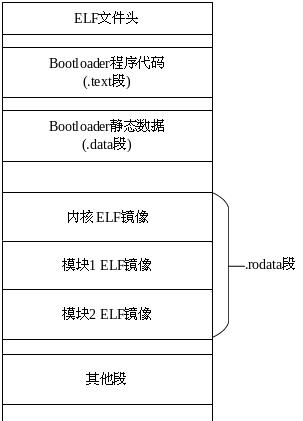

# Barrelfish 启动引导

[TOC]

## 启动与引导设计

Barrelfish采用了Mutil-kernel的设计思想，这意味着在内存中会存在多个操作系统的内核副本。在这种情况下，要求内核镜像能够根据具体的加载地址进行代码的重定位。为此，Barrelfish设计实现了一个基础的两级Bootloader和一个整合的可重定位的系统镜像。

Barrelfish启动引导流程基本如下：hake构建系统根据Hakefile生成启动菜单文件和Makefile文件,make程序根据Makefile文件编译生成内核，启动菜单中的各个模块，Bootloader。随后，将这些整合成一个ELF镜像，用于启动。在ELF镜像在模拟器或实际的硬件平台上加载后，Bootloader运行，启动内核并为内核准备必要的多启动信息。

下面介绍启动引导的详细设计。

### 启动菜单

Barrelfish支持Inter平台的X86_64，X86和ARM平台的armv7,armv8等体系结构，在各个体系结构根据板级BSP的不同分为不同的编译版本。各个版本的的物理地址范围、加载的模块、内核等均不尽相同，所以Barrelfish采用启动菜单的方式定义各种编译需要的信息：内核及其启动参数，模块及其启动参数，物理地址映射范围。

启动菜单一般有Barrelfish的编译工具hake生成，hake通过读取/platforms/Hakefile文件在/build/platforms/{arm | x86}/目录下生成menu.lst.xxxx文件。该Hakefile文件格式简要说明如下：
- 由Haskell语言编写，主要结构如下：
- Module定义，定义Module集合
  示例：`pandaModules = [ "/sbin/" ++ f | f <- [ "..."，"..." ]`
- Platform规则，构建platform的规则
  示例：`[... , platform "PandaboardES" [ "armv7" ](...), ...]`
- Boot images规则，构建boot image的规则
  示例：`[... , armv7Image "armv7_pandaboard" ... , ...]`
- Boot规则，用于qemu和gem5模拟器
  示例：`[..., boot "gem5_armv8" ... , ...]`

menu.lst.xxxx文件格式及说明如下：
- timeout定义： [TODO]
- title： 标题，无实际意义
- kernel： 内核及命令行参数
- module： 模块及命令行参数
- mmap: 物理起始地址，大小和类型（类型[TODO]）

### 系统镜像结构

Barrelfish的系统镜像采用ELF格式。其主要包括以下几个部分：Bootloader，内核镜像，启动菜单中的指定的各个模块（module）的镜像。

在S.Hitz的[Multicore armv7-a support for Barrelfish](http://citeseerx.ist.psu.edu/viewdoc/download?doi=10.1.1.348.6209&rep=rep1&type=pdf)一文中中给出了具体的生成过程如下:首先将内核和启动列表中的所有模块编译成可重定位的 ELF 文件,然后用 objcopy 将所用 ELF 文件合成为一个大的 ELF 文件,所有模块的 ELF 二进制镜像都放置在新的 ELF 文件的.rodata 段,然后编译一个 C 函数,这个函数能返回各个模块的基本信息用于多核启动,最后编译 Bootloader 并将所有文件链接到整合的 ELF 文件中。最终生成的 ELF 如下图所示。

## Bootloader设计与实现

### arm_molly

*该代码已废弃，代码分析略*

在Barrelfish中，为了实现内核镜像的动态加载，设计并实现了一个简单的二级Bootloader，被称作arm_molly。

arm_molly的第一级使用ARM汇编编写，主要功能是为第二级设置堆栈，并提供内核跳转函数用于从arm_molly跳转到内核。

arm_molly的第二级使用C语言编写。主要过程如下：
1. 调用3.1.1小节中所述的接口获取包含多核启动信息的数据结构，并从中读出内核镜像的开始位置，结束位置，大小等信息。
2. 加载内核镜像到内存中，并对内核镜像进行重定位。
3. 计算出内核的入口地址，调用第一级的接口跳转到内核运行。至此，Bootloader的任务完成，内核开始运行。

### arm_boot

